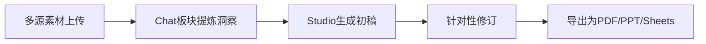

### **🚀 核心产品定位与市场表现**

**产品概述**
- **定义**：NotebookLM是谷歌推出的AI驱动内容处理平台，通过三栏式工作流实现从多源信息整合到成品内容生成的全流程管理。
- **市场地位**：经重大更新后，其**用户使用率和关注度已超越Gemini**，成为谷歌AI生态中增长最快的 productivity 工具。
- **核心优势**：解决多格式信息处理痛点，支持PDF、表格、视频等混合数据源的深度分析，且**输出内容严格基于原始素材**，大幅降低AI幻觉风险。

### **📊 功能架构与工具矩阵**

#### **一、三栏式核心工作流**

| 板块 | 功能定位 | 关键能力 |
| :-- | :-- | :-- |
| **左侧：来源板块** | 信息输入中枢 | 支持PDF/表格/音频/视频上传；集成Web搜索（Fast/Deep Research）；Google Drive联动 |
| **中间：聊天板块** | 分析交互层 | 自定义指令配置；对话历史管理；智能源指南（Source Guide）自动提炼关键洞察 |
| **右侧：Studio板块** | 内容生产引擎 | 11种输出工具分类；动态格式推荐；品牌风格适配 |

#### **二、Studio工具能力分级**

**🔥 第一档：日常必用工具**（使用频率高，ROI显著）

| 工具名称 | 核心功能 | 典型应用场景 |
| :-- | :-- | :-- |
| **报告生成器** | 自动将多源信息整合成结构化文档 | 竞品分析报告、财务总结、市场简报 |
| **幻灯片演示文稿** | 生成可编辑演示文稿（支持横版/竖版） | 商业提案、社交媒体图文、会议汇报 |
| **信息图表** | 将数据转化为可视化图形 | 关键指标展示、流程说明、活动宣传 |
| **思维导图** | 生成交互式知识图谱 | 内容规划、主题分析、学习笔记 |

**⚡ 第二档：情境化工具**（特定场景适用）

| 工具名称 | 功能特点 | 适用场景 |
| :-- | :-- | :-- |
| **数据表格** | 从非结构化文本提取结构化数据 | 竞品对比、财务分析、特征梳理 |
| **视频概述** | 生成带旁白的幻灯片式视频 | 访谈摘要、课程精华、会议回顾 |
| **电影式视频概述** | 含动画效果的高级视频摘要（需Ultras订阅） | 品牌宣传、重要概念讲解 |
| **测验生成器** | 创建基于素材的选择题 | 培训考核、直播互动、知识检验 |
| **抽认卡** | 提炼核心概念与术语 | 考试复习、术语记忆、知识点强化 |
| **音频概述** | 将文本转化为语音内容 | 通勤学习、内容速听、多任务处理 |

### **💡 高级使用策略与工作流**

#### **一、信息获取与管理技巧**

1. **多源整合方案**
	- **自有素材**：上传PDF/表格/幻灯片（支持Google Docs动态同步）
	- **外部补充**：Web+Fast Research（类似Google搜索）获取实时数据；Web+Deep Research自动生成研究报告
	- **语言突破**：支持日语等非英语文档上传，自动提取信息并以英文响应
2. **质量控制机制**
	- **来源筛选**：建议最多选择3个外部来源，人工审核确保质量
	- **活文档管理**：Google Docs/Sheets作为”活源”可实时同步更新；PDF为静态源需手动更新

#### **二、内容生产高级技巧**

1. **定制化输出配置**
	- **报告生成**：使用Gemini辅助生成自定义指令（格式：\[目标\]+\[受众\]）
	- **演示文稿**：指定”垂直9:16格式”生成社交媒体适配的竖版幻灯片
	- **品牌一致性**：上传品牌指南作为源文件，自动应用指定配色/字体
2. **工作流优化案例**

### **📝 关键限制与替代方案**

	- **核心局限**：因严格基于源素材，**创造力较弱**，不适合头脑风暴、创意文案等任务
	- **互补工具**：
	- 创意需求：使用Gemini/ChatGPT/CLAUDE
	- 深度研究：建议在Gemini中使用Deep Research功能
	- 代码生成：需配合专业AI编码工具

	### **🎯 典型应用场景**
	1. **商业分析**：整合市场报告+财务数据生成决策简报
	2. **知识管理**：构建会议记录知识库，支持精准信息检索
	3. **学习辅助**：生成课程内容思维导图与复习抽认卡
	4. **内容创作**：快速将长文转化为社交媒体图文/视频脚本
	5. **合规审查**：结合法规文件与业务数据，自动识别合规风险