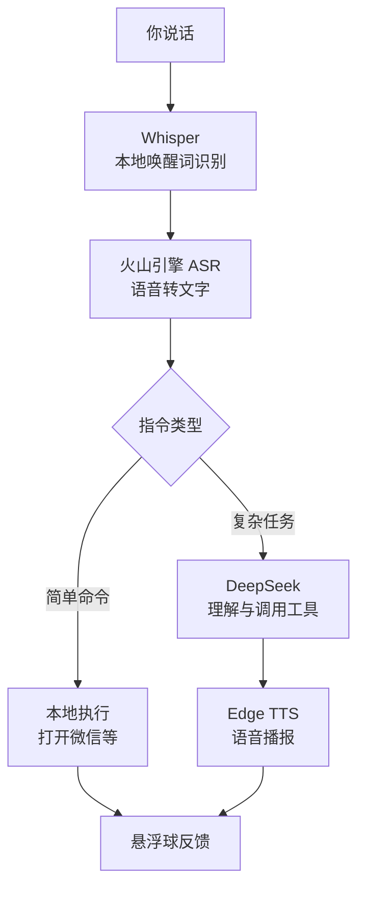

原来项目地址，支持mac电脑
https://github.com/forestai123456/Daisy-Voice-Agent

我改造后

```
npm run dev
```
#### 大语言模型
DeepSeek。

### 语音识别
订购火山引擎 Agent Plan
https://console.volcengine.com/ark/region:cn-beijing/subscription/agent-plan

### 联网搜索
Firecrawl


### 语音唤醒


### 使用

快捷键

按下快捷键 → 开始录音
持续按住 → 一直采集语音
松开快捷键 → 停止录音并提交识别
长快捷键 → 退出悬浮球
回答到一半想换问题，不要按 Esc，直接按住设置的快捷键说新问题即可

语音唤醒

你唤醒它 → 提问/执行任务 → 回答或完成动作
→ 自动回到聆听状态
→ 如果 6 秒都没有开始说话
→ 悬浮球约 0.5 秒后隐藏
→ 后台唤醒词监听仍继续运行

回答到一半想换问题，再说一次唤醒词,它会立即停止当前回答，进入聆听状态。

