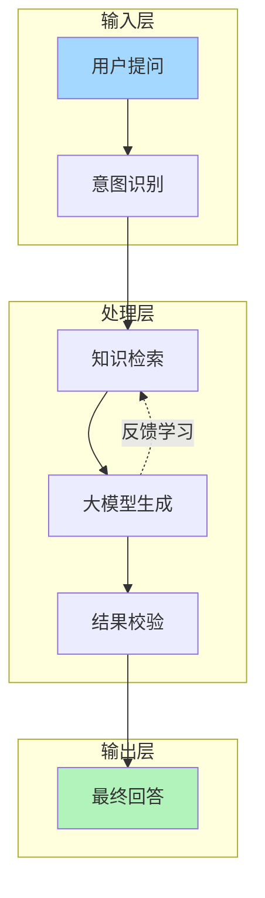

```mermaid
graph TB
    subgraph 输入层
        A[用户提问] --> B[意图识别]
    end
    subgraph 处理层
        B --> C[知识检索]
        C --> D[大模型生成]
        D --> E[结果校验]
    end
    subgraph 输出层
        E --> F[最终回答]
    end
    D -.反馈学习.-> C
    style A fill:#a5d8ff
    style F fill:#b2f2bb
```
